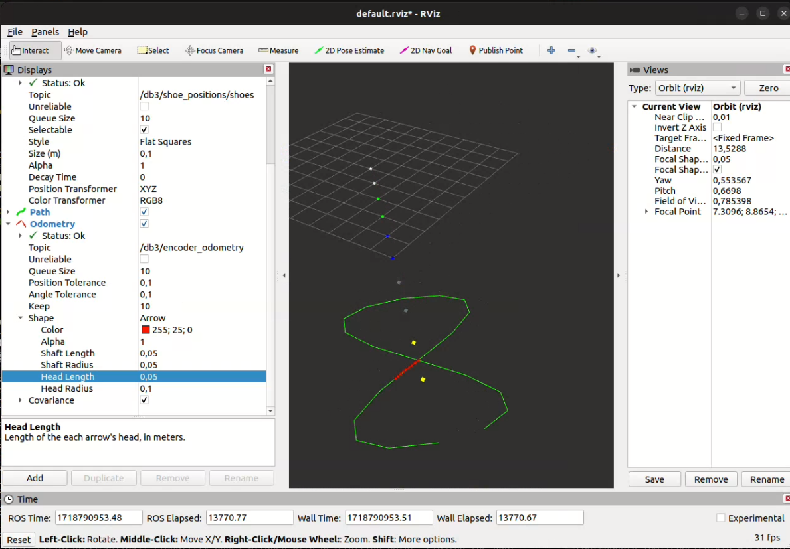
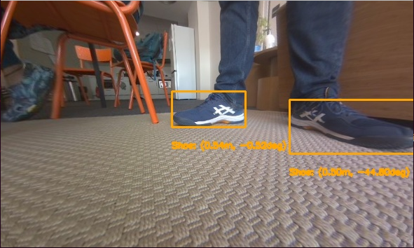
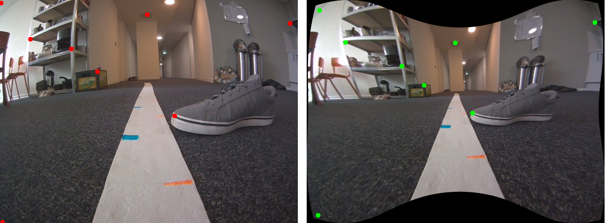
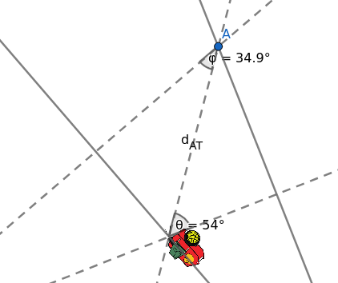
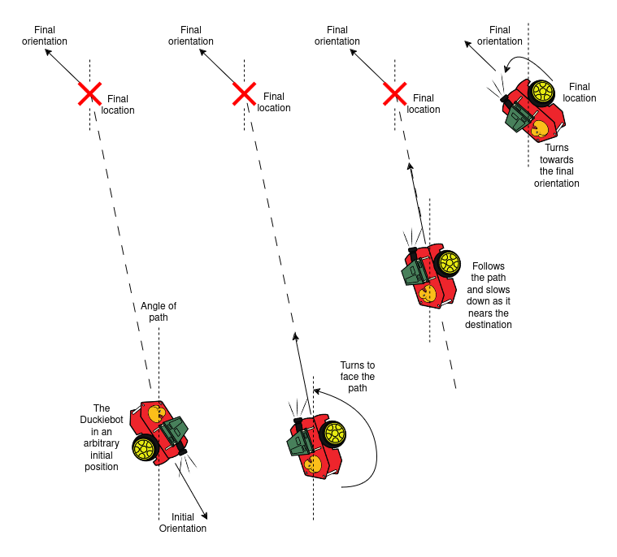
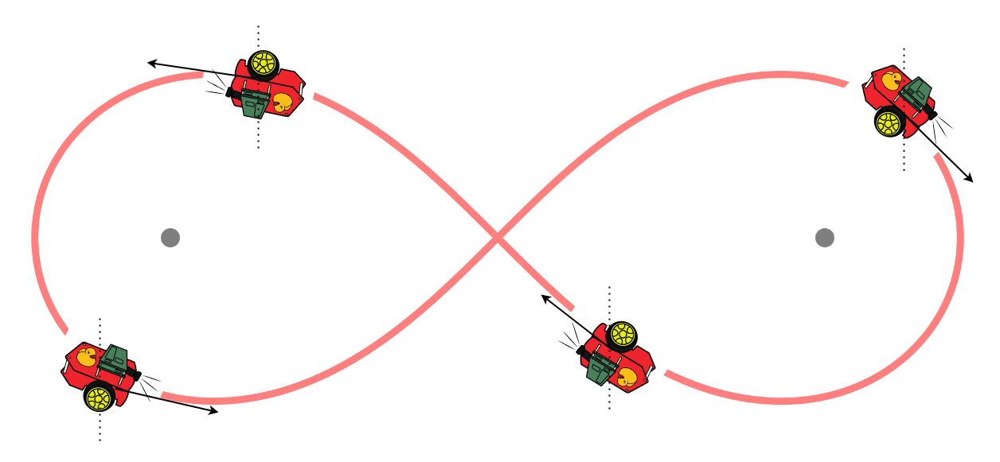
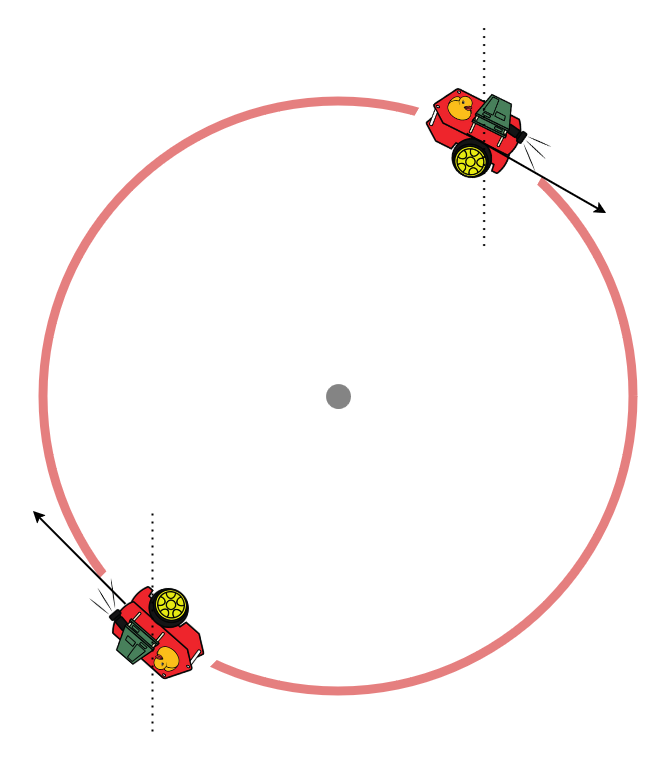
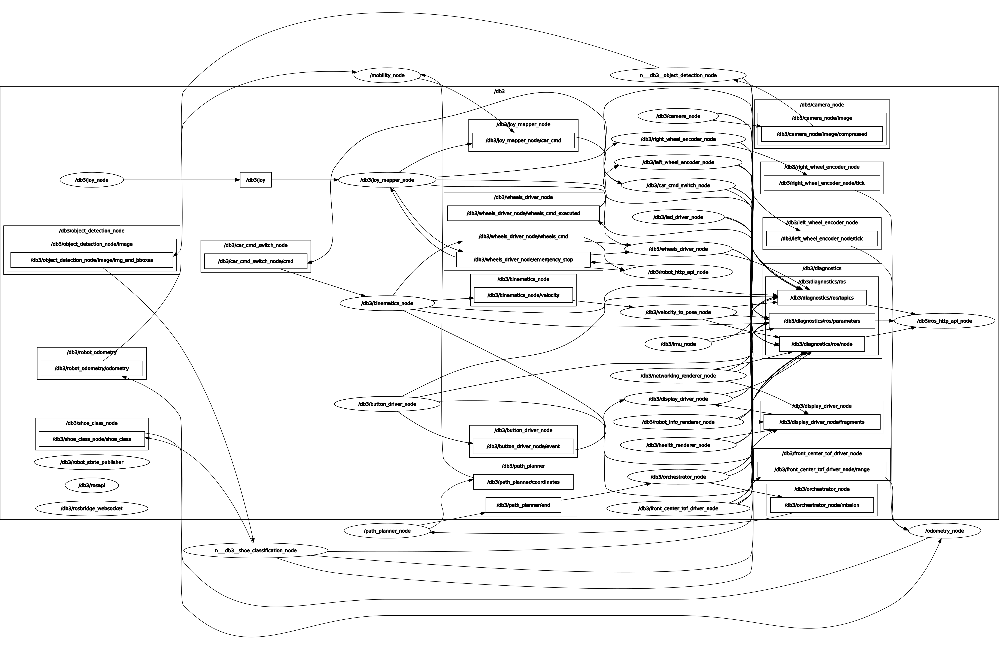
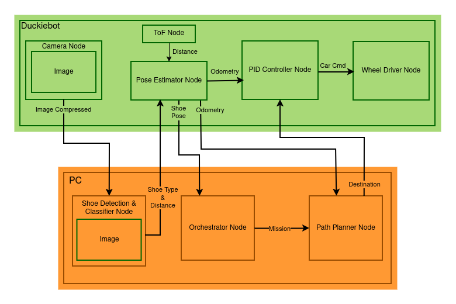

# Shoe-san: Environment analyzer and path planner Duckietown project

## Approach

The approach is separated into three different parts namely the visual control, motion control and path planning with the visual control forming the chunk of the operations. A Duckiebot uses two CNN’s to carry out its tasks. One CNN responsible for detection detects shoes and people in the camera’s frame of view and creates bounding boxes around the detected objects. The resulting bounding boxes are then forwarded to the next CNN that classifies the bounding box among five different types of shoes. The camera also plays two other important functions of estimating distance from the detected shoe and detecting April tags for localization and deriving the pose of the Duckiebot in the environment.

After a particular type of shoe has been identified in the frame of view, the planning part of the application gives instructions and paths for the Duckiebot to follow. The motion control helps the Duckiebot to stay on track using error correcting feedback loops.

### Object Detection

For the robot to navigate in the real world, it needs timely updates of its environment. While it can roughly calculate its position based on wheel encoders, it also requires feedback on the positions of objects and obstacles. This can be done using light sensors like Time of Flight sensors, but also with camera feed for more accuracy and information. In our implementation, we use the Yolov5 Object Detection model to identify people and shoes in the camera frame. Yolov5 provides classification among these two labels and the bounding boxes of the corresponding objects. Bounding boxes contain the (x, y) coordinates of the top left and bottom right corners.

We perform Visual Distance Estimation to determine the distance and angle of the object relative to the robot. The results are stored in a message type `Rect` along with the bounding boxes and encoded into a `SceneSegments` message type, which is relayed to the Shoe Classification Node.

### Image Classification

Our application exhibits different behaviors depending on the detected shoe while also estimating the position of each shoe. The Shoe Classification node subscribes to the topic published by the Object Detection node, containing the original distorted image and identified bounding boxes with calculated distances and angles. It then classifies each shoe into one of five labels: "Sergio," "Shashank," "Tom," "Varun," or "Vasilis." The node organizes these classifications into a 10-object array, accounting for both feet of each person, and updates the positions and states of the detected shoes.

The Image Classifier uses a CNN trained with over 5000 images to minimize classification errors. The CNN performs better with shoes of vibrant colors but sometimes misclassifies shoes with secondary colors like brown, white, and grey.

### Object Pose Estimation

To build a virtual map and plan its moves, the robot needs to know the locations of objects around it. This is achieved using a combination of techniques, including Time of Flight sensors and visual distance estimation.

#### Time-of-Flight Sensor

The Time of Flight sensor measures the distance between the sensor and obstacles. It is used to detect the distance between the shoe and the Duckiebot, complementing the visual distance estimation techniques.

#### Visual Distance Estimation

Using a pinhole camera model, we undistort the image to estimate the relative position of an object. The OpenCV toolkit helps transform and analyze the image. The bounding box of the shoe provides the depth projection, and the distance is calculated using trigonometric identities.

### Odometry

The robot uses two sources of odometric information, merged with a Kalman filter. The Kalman filter combines several sensor inputs to predict and update the robot's state.

#### Encoder Odometry

Encoders estimate the robot's pose by calculating the distance traveled and orientation change. Using the encoder data, we can determine the increments in each axis.

#### April Tags

The April Tags library provides precise information on the distance to a tag from the robot. By placing tags in the environment, the robot can calculate its position relative to these tags using trigonometry.

### Motion Control

The robot follows a sequence of goal positions in global coordinates using a PID controller. The PID controller adjusts the robot's linear and angular velocities to reduce the errors in distance and angle between the current and goal positions. The state machine changes the behavior of the PID depending on the robot's situation relative to the goal position.

### Path Planning

Using the position information of the robot and shoes, the path planner node generates poses for the Duckiebot to follow using trigonometric functions. These poses are visualized in RVIZ and sent iteratively to the PID controller.

#### Eight Figure Path

The eight-figure path is calculated using the midpoints and distance between two points (shoes). The path is described by the following equations.

$x = (distance/2 + radius) \cdot cos(\theta)$ \
$y = {radius}* \sin(2\theta)$\
$x_{path} = midx + x\cdot cos(\theta) - y\cdot sin(\theta)$\
$y_{path} = midy + x\cdot sin(\theta) + y\cdot sin(\theta)$

#### Circular Path

The circular path is calculated similarly, using the midpoints of the points and trigonometric functions to describe the path.

### ROS Graph and Node Functionality

The architecture of the final implementation is visualized using RosGraph. The nodes and their communication are illustrated in a simplified diagram.

## Deployment Details

The nodes were created using the basic [duckietown template](https://github.com/duckietown/template-basic). The CNN for object detection and classification runs on a laptop to minimize latency, while other nodes like odometry and PID run remotely on the Duckiebot for real-time tasks. The ROS core, initialized by launch scripts, runs on the Duckiebot to optimize node communication and performance.
